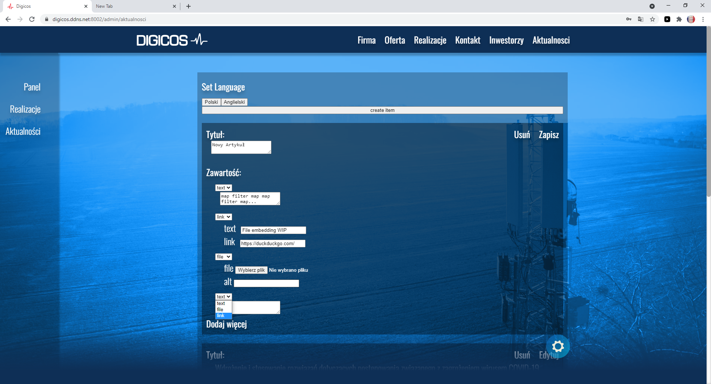
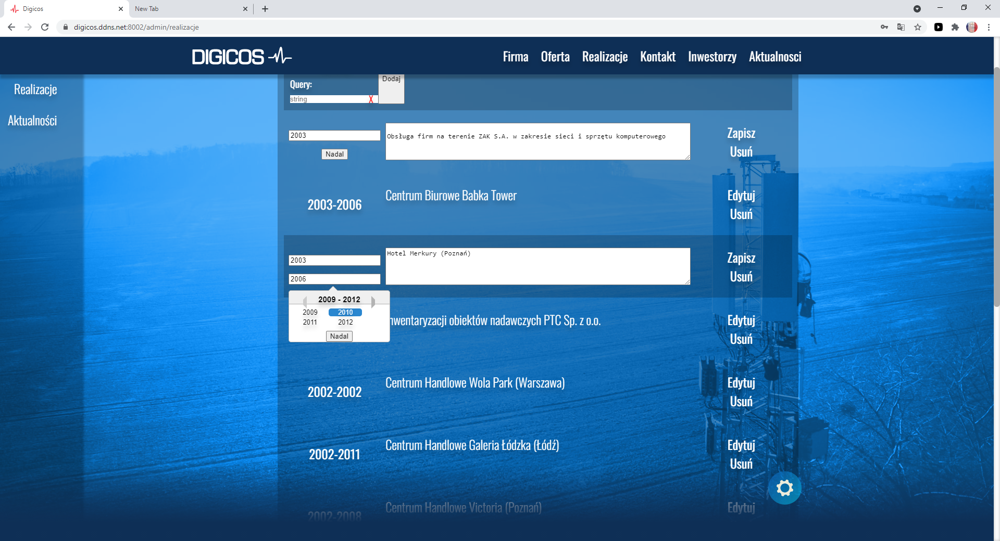

This is my biggest project yet and I had lots of fun building it. I started it having very little knowledge of both React and FastAPI. At first I tried doing it the way organizers of contest intended, in WP, but I found it extremely boring. Then I tried making a custom theme and plugins with PHP. It was more interesting, but I found myself fighting wordpress a lot. Finally, I decided to scratch everything and create this application with technologies I was excited to learn. That was a good idea. My initial designs were horrendous, and even though it's still not a design masterpiece, I'm happy I choose to build it myself.

Main motivation behind this project was to learn, mostly about modern frontend and CSS, since all of my previous web apps in Flask/Django looked bad. I'm looking forward to using Typescript and React a lot more in future projects. ^^

# The actual README:
A website made for Digicos S.A. website contest. Even after ditching wordpress, it went through many iterations. I Initially started with React and FastAPI + MongoDB. As the project grew I made a version of it in Next.js. Then I switched from React Transition Group to Framer-Motion. Another consideration was react-redux, but later on I decided that ContextAPI is sufficient. I added Typescript late in to the project, but It's so extremely useful I love it. It uses React Router DOM.

The dynamic dns points to the host with Let's Encrypt SSL certificate.
It's hosted on https://digicos.ddns.net:8002/
, unless the laptop that serves it died.

This is the cms part.

Translation and things like limited animation mode are working, but not implemented everywhere.
